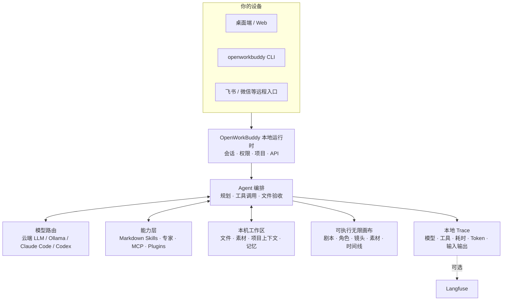

<p align="center">
 
</p>

<h1 align="center">OpenWorkBuddy</h1>

<p align="center"><b>基于 OpenWorkBuddy 二次开发的本地 AI 工作空间</b></p>

<p align="center">
 <b>跑在你自己电脑上的 AI 办公助理。</b><br>
 交代一句话，它自己规划、动手、验收，把 PPT / Word / Excel / 网页落到你硬盘上。<br>
 <b>给你的是能打开的文件，不是一段聊天记录。</b>
</p>

<p align="center">
 <sub>A local-first AI office agent that hands you files, not chat logs. · <a href="README.en.md"><b>English</b></a></sub>
</p>

<p align="center">
 <a href="#三分钟跑起来"><b>▶&nbsp;三分钟跑起来</b></a>
 &nbsp;·&nbsp; <a href="https://github.com/CatCatUncle/openworkbuddy/releases">下载安装包</a>
 &nbsp;·&nbsp; <a href="docs/功能清单.md">功能清单</a>
 &nbsp;·&nbsp; <a href="#文档">文档</a>
 &nbsp;·&nbsp; <a href="#交流群">交流群</a>
 &nbsp;·&nbsp; <a href="CHANGELOG.md">变更记录</a>
</p>

<p align="center">
 <a href="https://github.com/CatCatUncle/openworkbuddy/stargazers"></a>
 <a href="LICENSE"></a>
 <a href="docs/功能清单.md"></a>
 <a href="docs/功能清单.md"></a>
 <a href="docs/功能清单.md"></a>
 <a href="docs/功能清单.md"></a>
</p>

<p align="center">
 <sub>自己用、学习用、非营利用 <b>免费</b>；公司里用要授权，<a href="#协议">一句话讲清 ↓</a></sub>
</p>

<p align="center">
 
</p>

---

## 你说一句，它交给你

| 你说一句 | 它交给你 |
|---|---|
| 帮我出一份 Q3 复盘 PPT，数据用这个 Excel | 读表 → 算 → 一个能直接放的 `.pptx` |
| 调研国内 AI 陪伴产品，出一份报告 | 联网搜 → 逐个打开读 → Markdown / Word |
| 把这份材料做成手机上能看的网页 | 写 HTML → 起本机服务 → 扫码就能看（[成品](https://hunan-travel.pages.dev/)） |
| 每天 9 点抓行业新闻，做成晨报发我飞书 | 定时任务 + IM 推送，错过了会补跑 |

<p align="center">
 
</p>

> [!NOTE]
> 多任务并行、目标验收、👍👎 进自进化、双层记忆、权限档位、IM 远程指挥、桌面宠物…… 全部能力见 **[功能清单](docs/功能清单.md)**。

## 为什么是它

<table>
<tr>
<td width="50%" valign="top">

<b>📄 文件是真的。</b>

PPT / Word / Excel / 网页都真生成，成果面板里点开就能验收。说写了文件却不在磁盘上，当场拦下重做。

</td>
<td width="50%" valign="top">

<b>🔌 模型随便换，东西全在你手里。</b>

DeepSeek / 通义 / 智谱 / Kimi / OpenRouter / Ollama 界面点一下就切；本机装了 <b>Claude Code / Codex</b> 的，一键拿它当发动机，不用另买 token。会话、文件、Key 全在本机，默认只听 <code>127.0.0.1</code>。

</td>
</tr>
<tr>
<td width="50%" valign="top">

<b>🧩 加个能力 = 丢一个 Markdown 文件。</b>

存成 <code>skills/&lt;名字&gt;/skill.md</code>，存盘后下一条任务就生效——不改代码、不重启、不打包。

</td>
<td width="50%" valign="top">

<b>🔍 也适合拿来读懂 Agent。</b>

模型路由、工具调用、文件验收、记忆、权限、本地 Trace 全在同一个仓库里：一条真实任务，从它为什么这么做到最后交了什么，你都看得见。

</td>
</tr>
</table>

## 三分钟跑起来

**macOS**（一个弹窗都没有）：

```bash
curl -fsSL https://raw.githubusercontent.com/CatCatUncle/openworkbuddy/main/install-mac.sh | bash
```

**Windows**：[Releases](https://github.com/CatCatUncle/openworkbuddy/releases) 下 `-win-setup.exe`（x64 / ARM 通用）；不让装软件就用免安装版 `-win-x64-portable.exe`。

**源码**（Node.js 18+，零构建）：

```bash
git clone https://github.com/CatCatUncle/openworkbuddy.git
cd openworkbuddy && npm install
npm run app # 桌面版；或 npm start → http://localhost:3800
```

填一个模型 Key，然后说人话就行。数据都在 `~/OpenWorkBuddy`，卸载不删。字号、主题在右上角头像 →「外观」。

<details open>
<summary><b>第一次打开被系统拦住</b></summary>

<br>

证书还在申请，包是 ad-hoc 签名：系统拦的是「没见过的开发者」，不是文件有毒。

- **macOS 无法验证**：弹窗点「完成」→ 系统设置 → 隐私与安全性 → 拉到底点「仍要打开」。或者把 .app 拖进「应用程序」后跑 `xattr -dr com.apple.quarantine /Applications/OpenWorkBuddy.app`。网上「右键 → 打开」只对 macOS 14 及更早有效。
- **macOS 已损坏**：签名被网盘/解压工具弄坏了，重下一次。
- **Windows**：「更多信息」→「仍要运行」。
- **双击没反应**：看 `~/OpenWorkBuddy/logs/boot.log` → [安装与启动](docs/安装与启动.md#双击了没反应)

</details>

## 长这样

**「同一个人，换四个场景，手里举块写着字的牌子——要像随手拍的，别像 AI 图」**

<p align="center">
 
</p>

难的不是画人，是四张里得是同一个人、牌子上的中文不能糊。它先出一张，再用看图工具真去读自己刚生的那张（不是凭记忆吹），确认了才照这个方向铺开其余三张。

**「做个湖南旅游攻略网站，14 个市州一个都不能少」**

<p align="center">
 <a href="https://hunan-travel.pages.dev/"></a>
</p>

**<https://hunan-travel.pages.dev/>** —— 点开就能逛。一个 HTML 加一个图片文件夹，不挂任何外部 CDN，扔到静态托管上就是一个站。这不是截图拼的示意图，是它交出来的那份东西本身。

**「每天早上七点，把今天的天气和该注意的事发到我飞书」**

<p align="center">
 
</p>

一句话排出来的定时任务，人不在电脑前也照跑；每趟调了哪些工具、为什么这么说，都在「自动化 → 运行记录」里点得开。飞书 / 企微 / 钉钉 / Telegram 同一条路。

怎么做到的、本机 Claude Code 当发动机长什么样 → **[三个案例，拆开讲](docs/案例.md)**

## AI 短剧无限画布

剧本、角色、场景、分镜、参考图、视频、配音、时间线摆在同一张图上。连线不是装饰——它表示下一步生成真会去读的角色、首帧和声音。改哪个镜头，只有那个镜头重跑。

<p align="center">
 
</p>

左侧点「无限画布」就能开始。空白处拖拽平移，`Shift`+拖拽框选，`Shift`/`⌘` 点节点加选减选，底部对话框里能 `@` 引用任意节点和素材。

## 放服务器给团队用

```bash
git clone https://github.com/CatCatUncle/openworkbuddy.git && cd openworkbuddy
bash deploy.sh --domain buddy.example.com # Docker + 自动 HTTPS
```

多租户、席位、额度、离职一键收权限都有。**起来先注册管理员**——第一个注册的就是超管。
→ [部署](docs/部署.md) · [运维手册](deploy/README.md) · [多人协作](docs/多人协作.md)

## 配模型

**设置 → 模型**，挑预设（OpenAI / Anthropic / OpenRouter / DeepSeek / 通义 / 智谱 / Kimi / 火山方舟 / Ollama），粘 Key，保存即生效。生图、配音、生视频另有一张表。对照表 → [配置模型](docs/配置模型.md)

> [!IMPORTANT]
> Key 只存在 `config.json`，已在 `.gitignore` 里，别手滑提交。

## 命令行也能用

`openworkbuddy` 跟桌面版**共用同一份**配置、技能、记忆、连接器和会话——终端里起的活儿，手机和网页上看得见、插得上话；桌面上做到一半，终端里 `openworkbuddy resume` 接着往下走。

```bash
npm link # 一次性：装成全局命令（也可以直接 node cli.js …）

openworkbuddy "帮我写一份本周周报" # 单发：跑完就退
openworkbuddy # 交互：连续对话，打一个 / 出命令菜单
cat error.log | openworkbuddy "这是什么问题" # 管道：管道内容当材料送进去
openworkbuddy -q "生成本周周报" > 周报.md # 文件里只有周报，没有进度条

openworkbuddy engines use claude-code # 换执行引擎：跑在你已经付过钱的订阅上，不烧 API 额度
```

单发和管道模式下**不会**反问你，脚本和 cron 里不会卡住。退出码说实话：`0` 成功、`1` 任务失败、`2` 参数写错、`130` Ctrl+C，所以 `openworkbuddy doctor && npm start` 拦得住没配好的机器。

`sessions` / `resume` / `engines` / `doctor` / `pair`（扫码把手机连上来）/ `worktree`，以及 `--mode` `--perm` `-C` `-f` `--json` 等全部参数 → **[命令行用法](docs/命令行用法.md)**

## 它是怎么搭的



这张图也是读代码的路线：从 `server.js` 进去，再看 `agent.js` 怎么编排模型和工具。细节 → [实现细节](docs/实现细节.md)

## 最新动态

- **09-23** 命令行加 `/review`、自定义斜杠命令、`--model` 等开关；能配钩子；`workflow` 按文件分步跑
- **09-23** 写代码更顺手：按名找文件、一个文件改多处、读后被改就拦、后台跑命令，进度清单没打勾不许收工
- **09-23** 预览卡和右边预览面板打开的是同一版图，每张卡带版本时间戳
- **09-23** 做完不再擅自 `open` 文件，你说「打开」才开，交付只报路径
- **09-23** 记忆超预算时规矩先进门，「交付别替我打开文件」这类不再被挤掉
- **09-23** 加载过的技能挂进系统提示词，历史压缩、下一轮续跑都不丢
- **09-22** 打 `/` 挑技能不再一回车就发出去；新装的技能不用刷新页面就能挑
- **09-22** 手机上那排键热区抬到 44px，一次点中

更早的看 **[变更记录](CHANGELOG.md)**。

## ⚠️ 这个 agent 手里有 shell

它能跑命令、读写文件、上网，所以有命令审批、文件黑名单、URL 白名单、审计日志和四档权限。装别人的技能前会先过一遍静态体检，危险的默认不装——但它不是杀毒，装前自己读一眼 `skill.md`。
**放公网前先读 [安全](docs/安全.md)**，默认配置只为本机调。

## 交流群

用崩了、有想法、想一起改，进飞书群直接说：

<p align="center">
 
</p>

## 一起把它做下去

- **用崩了、卡住了，开个 [issue](https://github.com/CatCatUncle/openworkbuddy/issues/new)**，哪怕只贴一句报错——你以为「只有我遇到」的坑，多半所有人都在踩。贴之前扫一眼，别把 API Key 带上。
- **10 分钟** 写个技能：一个 Markdown 存成 `skills/<名字>/skill.md`，存盘即生效，[模板在这](CONTRIBUTING.md#提交一个技能3-分钟)
- **一晚上** 挑个 issue 改：`npm install && npm start` 就跑起来，`npm test` 不用 API Key 也能全绿

项目结构、测试、PR 规范都在 [参与贡献](CONTRIBUTING.md)。不用先开 issue 问，直接发 PR。

## 文档

| 文档 | 一句话 | 文档 | 一句话 |
|---|---|---|---|
| [功能清单](docs/功能清单.md) | 全部能力、技能与工具 | [部署](docs/部署.md) | 服务器 / Docker / 反代 |
| [案例](docs/案例.md) | 上面那几张图怎么做出来的 | [多人协作](docs/多人协作.md) | 多租户、账号、权限、额度 |
| [安装与启动](docs/安装与启动.md) | 安装包、源码、常见卡壳 | [安全](docs/安全.md) | 审批闸门、黑白名单、审计 |
| [配置模型](docs/配置模型.md) | 各家 base_url / 模型名对照 | [数据同步与搬家](docs/数据同步与搬家.md) | 数据存哪、换电脑怎么搬 |
| [命令行用法](docs/命令行用法.md) | CLI 参数、管道、`--json`、cron | [开源与商业版边界](docs/开源与商业版边界.md) | 买授权到底买到什么 |
| [扩展](docs/扩展.md) | 写技能、接 MCP、装插件、建专家 | [路线图](docs/路线图.md) | 接下来做什么、怎么算做完 |
| [IM 与定时任务](docs/IM与定时任务.md) | 飞书 / QQ / 企微 / 微信 / 钉钉 | [变更记录](CHANGELOG.md) | 一句话一条，最新在上 |
| [实现细节](docs/实现细节.md) | agent 主循环怎么转的 | [参与贡献](CONTRIBUTING.md) | 项目结构、测试、提 PR |
| [安全基线](docs/安全基线.md) | 数据落在哪、谁看得见、哪些没做到 | [远程访问](docs/远程访问.md) | 手机/外网连本机，两个开关默认关着 |

## 同一个作者的其他项目

- **[toolward](https://github.com/CatCatUncle/toolward)** —— 给 agent 用的技能 / MCP 连接器静态安检：37 条规则分六族，零运行时依赖。`npm i -g toolward` 装上，OpenWorkBuddy 自动把它当第二把尺子用，不装也完全不影响。同样是 PolyForm Noncommercial。

## 协议

**自己用、学习用、非营利用免费；拿去赚钱（含公司内部用）需要商业授权。**
协议 [PolyForm Noncommercial 1.0.0](LICENSE)，商用怎么谈见 [COMMERCIAL-LICENSE.md](COMMERCIAL-LICENSE.md)。买授权不解锁功能——只有这一份代码。部署配置、脚本、技能模板等另按 MIT 发布（[LICENSE-ECOSYSTEM.md](LICENSE-ECOSYSTEM.md)）。

Copyright (c) 2026 开发者猫叔

## 免责声明

独立开源项目，与腾讯及其 WorkBuddy 产品无任何关联，不含其代码或素材；对接的 IM 均走公开接口。借鉴来源见 [NOTICE.md](NOTICE.md)。有问题请开 [Issue](https://github.com/CatCatUncle/openworkbuddy/issues)。

## 支持这个项目

<p align="center">
 <a href="https://github.com/CatCatUncle/openworkbuddy">
 
 </a>
</p>

<p align="center">
 <a href="https://github.com/CatCatUncle/openworkbuddy"></a>
</p>

<p align="center">
 <sub>顺手把它转给一个天天手搓 PPT、周报、会议纪要的同事，比一百次曝光管用。</sub>
</p>

## 贡献者

感谢每一个动手改过这个项目的人。想加入他们：[参与贡献](CONTRIBUTING.md)。

<p align="center">
<a href="https://github.com/CatCatUncle/openworkbuddy/graphs/contributors">
 
</a>
</p>

## Star 历史

<p align="center">
<a href="https://star-history.com/#CatCatUncle/openworkbuddy&Date">
 <picture>
 <source media="(prefers-color-scheme: dark)" srcset="https://api.star-history.com/svg?repos=CatCatUncle/openworkbuddy&type=Date&theme=dark">
 
 </picture>
</a>
</p>

## 关于作者 · 合作

前大厂 Agent 工程师，有丰富的 Agent 落地实践经验。

- ✔️ 服务过跨境电商、制造业、AI 初创、私募金融机构、消费品巨头、国央企等客户的 AI 解决方案
- ✔️ 企业 AI 内训 ｜ 企业私有化部署 ｜ 行业智能体 ｜ AI 数字化全案 ｜ AI 搜索优化 ｜ Agent 项目落地

常驻深圳，欢迎前来交流和考察。

FDE（驻场工程）、Agent 项目落地及其他企业 AI 业务合作，请直接邮件联系：[contact@aijentra.com](mailto:contact@aijentra.com)
